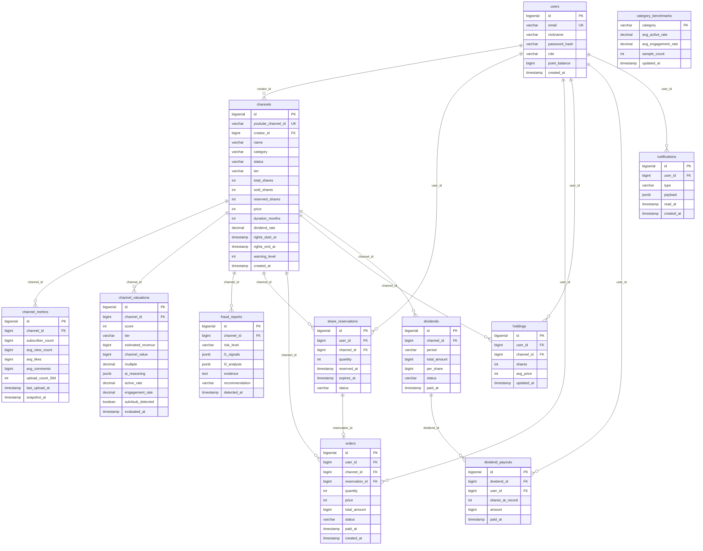

# Finnect — 유튜브 채널 광고수익 조각 투자 플랫폼

> 일반 투자자가 유튜브 채널의 광고 수익을 조각 단위로 구매하고, 매월 배당을 수령하는 핀테크 플랫폼

[](https://spring.io/projects/spring-boot)
[](https://openjdk.org/)
[](https://www.postgresql.org/)
[](https://spring.io/projects/spring-ai)
[](https://www.anthropic.com/)
[](https://render.com)

---

## 목차

- [비즈니스 모델](#비즈니스-모델)
- [주요 기능](#주요-기능)
- [시스템 아키텍처](#시스템-아키텍처)
- [AI 에이전트 구성](#ai-에이전트-구성)
- [데이터베이스 설계](#데이터베이스-설계)
- [기술 스택](#기술-스택)
- [패키지 구조](#패키지-구조)
- [API 명세](#api-명세)
- [비즈니스 정책](#비즈니스-정책)
- [로컬 실행](#로컬-실행)
- [배포](#배포)

---

## 비즈니스 모델

**수익 분배형 증권 (Revenue Share Note)** 모델을 채택합니다.

```
크리에이터                     투자자
    │                            │
    │  채널 광고수익의 N%를       │
    │  일정 기간 배당 약정        │
    │                            │
    └──────────── 조각 판매 ─────┘
                      │
              매월 배당 수령
              (만기 후 자동 소멸)
```

| 구분 | 내용 |
|------|------|
| 유사 서비스 | 뮤직카우(음악 저작권), Royalty Exchange |
| MVP 거래 구조 | 정찰제 쇼핑몰 (사용자 간 매칭 없음) |
| 법적 포지셔닝 | 가상 포인트 결제 → 자본시장법 우회 |
| 원금 보장 | ❌ (채권 아님) |
| 영구 소유권 | ❌ (주식 아님) |

---

## 주요 기능

### 크리에이터 (판매자)
- YouTube 채널 연결 및 등록
- AI 기반 채널 가치 평가 (자동 심사)
- 조각 발행량 · 단가 · 배당율 · 권리 기간 설정

### 투자자 (구매자)
- 채널 리스트 탐색 및 상세 조회
- AI 평가 결과 + 사기 탐지 리포트 열람
- 조각 구매 → 매월 배당 수령
- 보유 현황 대시보드

### 플랫폼 자동화
- **월 1회** 자동 배당 지급 스케줄러
- **매일 자정** 채널 만기 처리 스케줄러
- **매일 자정** 채널 비활성 경보 스케줄러
- **주 1회** 사기 재탐지 스케줄러

---

## 시스템 아키텍처

```
┌──────────────────────────────────────────────────────────────┐
│                         Client Layer                         │
│              Next.js 15 (App Router) · Vercel                │
└─────────────────────────────┬────────────────────────────────┘
                              │ REST API
┌─────────────────────────────▼────────────────────────────────┐
│                       Backend Layer                          │
│            Spring Boot 3.5 · Java 21 · Render                │
│                                                              │
│  ┌──────────┐ ┌──────────┐ ┌──────────┐ ┌────────────────┐  │
│  │  user    │ │ channel  │ │ trading  │ │   dividend     │  │
│  └──────────┘ └──────────┘ └──────────┘ └────────────────┘  │
│  ┌──────────┐ ┌──────────┐ ┌──────────┐ ┌────────────────┐  │
│  │ fraud    │ │valuation │ │  infra   │ │  notification  │  │
│  └──────────┘ └──────────┘ └──────────┘ └────────────────┘  │
└──────┬────────────────────────────┬────────────────────────┬─┘
       │                            │                        │
┌──────▼──────┐          ┌──────────▼──────┐    ┌───────────▼──┐
│  PostgreSQL │          │  Claude API     │    │  YouTube     │
│  (Render)   │          │  (Anthropic)    │    │  Data API v3 │
└─────────────┘          └─────────────────┘    └──────────────┘
```

---

## AI 에이전트 구성

Finnect는 **채널 가치평가**와 **사기 탐지** 두 파이프라인에 AI를 활용합니다.

### 1. 채널 가치평가 파이프라인

```
YouTube Data API
      │
      ▼
┌─────────────────────────────────────────┐
│          L1: 정량 지표 수집             │
│                                         │
│  • 구독자 수           • 평균 조회수    │
│  • 평균 좋아요         • 평균 댓글수    │
│  • 30일 업로드 횟수    • 마지막 업로드  │
└──────────────────────┬──────────────────┘
                       │
                       ▼
┌─────────────────────────────────────────┐
│        L2: Claude 정성 평가             │
│        (Spring AI → Anthropic)          │
│                                         │
│  • 채널 콘텐츠 일관성 분석             │
│  • 수익 지속 가능성 추론               │
│  • 카테고리 내 포지셔닝               │
└──────────────────────┬──────────────────┘
                       │
                       ▼
┌─────────────────────────────────────────┐
│           channel_valuations            │
│                                         │
│  score            : 0 ~ 100점           │
│  tier             : BRONZE/SILVER/GOLD  │
│  estimated_revenue: 추정 월수익 (원)    │
│  channel_value    : 채널 가치 (원)      │
│  ai_reasoning     : 추론 근거 (JSONB)   │
└─────────────────────────────────────────┘
```

### 2. 사기 탐지 파이프라인 (2-Layer)

```
┌──────────────────────────────────────────────────────────────┐
│                    L1: 룰 엔진 (정량)                        │
│                YouTube 공식 정책 기반                        │
│                                                              │
│  Rule 1. 비활성 구독자 비율 — Fake Engagement Policy        │
│          active_rate = avg_view_count / subscriber_count     │
│                                                              │
│  Rule 2. 반복 댓글 비율 — Spam Policy                       │
│          repetitive_comment_rate > 임계값                    │
│                                                              │
│  Rule 3. Sub4Sub 키워드 감지 — Spam Policy                  │
│          댓글/설명란 sub4sub 키워드 패턴 매칭               │
└────────────────────────────┬─────────────────────────────────┘
                             │
                             ▼
┌──────────────────────────────────────────────────────────────┐
│                  L2: Claude LLM (정성)                       │
│                  Spring AI → Anthropic                       │
│                                                              │
│  Rule 4. 미끼성 메타데이터                                   │
│          영상 제목·설명 vs 실제 콘텐츠 일관성 분석          │
└────────────────────────────┬─────────────────────────────────┘
                             │
                             ▼
┌──────────────────────────────────────────────────────────────┐
│                      fraud_reports                           │
│                                                              │
│  risk_level    : HIGH / MEDIUM / LOW                        │
│  l1_signals    : L1 룰별 점수 (JSONB)                       │
│  l2_analysis   : Claude 분석 결과 (JSONB)                   │
│  evidence      : 판정 근거 텍스트                            │
│  recommendation: APPROVE / REJECT / MONITOR                 │
└──────────────────────────────────────────────────────────────┘
```

**판정 결과 반영**

| risk_level | 등록 시 | 주간 재검사 시 |
|------------|---------|--------------|
| HIGH | 채널 등록 차단 (`status=SUSPENDED`) | 보유자 `RISK_CHANGED` 알림, 배당 보류 |
| MEDIUM | 등록 허용, 모니터링 | 보유자 경고 알림 |
| LOW | 등록 허용 | 자동 `ACTIVE` 복귀 |

**임계값 전략**

| 지표 | 절대값 기준 | 카테고리 상대 기준 |
|------|------------|------------------|
| `active_rate` | 자체 설정 | `active_rate_vs_category` (카테고리 평균 대비 %) |
| `engagement_rate` | 자체 설정 | `engagement_rate_vs_category` |
| `repetitive_comment_rate` | 자체 설정 | — |

> 카테고리 평균은 `category_benchmarks` 테이블에 일 1회 재계산됩니다.  
> HypeAuditor 등 제3자 기준 데이터는 사용하지 않습니다 (공신력 논란 회피).

---

## 데이터베이스 설계

### ERD



### 테이블 요약

| 테이블 | 설명 | 핵심 설계 포인트 |
|--------|------|-----------------|
| `users` | 회원 | `role` 단일 컬럼 (INVESTOR/CREATOR/ADMIN) |
| `channels` | 채널 (투자 상품) | `sold_shares + reserved_shares ≤ total_shares` 불변식 |
| `channel_metrics` | 유튜브 지표 시계열 | 주 1회 누적 (행 삭제 없음) |
| `channel_valuations` | AI 가치평가 이력 | 재평가마다 새 행 추가 |
| `fraud_reports` | 사기 탐지 이력 | 주 1회 새 행 추가 (이력 보존) |
| `category_benchmarks` | 카테고리 평균 | 일 1회 upsert |
| `share_reservations` | 결제 선점 | `expires_at` 만료 → 자동 취소 |
| `orders` | 구매 기록 | 정찰제, `quantity × price = total_amount` |
| `holdings` | 보유 조각 | `UNIQUE(user_id, channel_id)` — 채널별 1행 |
| `dividends` | 월 배당 원장 | `UNIQUE(channel_id, period)` — 중복 생성 방지 |
| `dividend_payouts` | 개인별 배당 지급 | 기준일 holdings 스냅샷 기록 |
| `notifications` | 알림 | JSONB payload로 타입별 확장 |

---

## 기술 스택

### Backend

| 분류 | 기술 |
|------|------|
| 언어 / 런타임 | Java 21 |
| 프레임워크 | Spring Boot 3.5 |
| 빌드 | Gradle (Kotlin DSL) |
| ORM | Spring Data JPA (Hibernate 6) |
| DB 마이그레이션 | Flyway 11 |
| AI 클라이언트 | Spring AI 1.0 |
| API 문서 | SpringDoc OpenAPI (Swagger UI) |
| 코드 생성 | Lombok |
| 스케줄러 | Spring Scheduler (`@Scheduled`) |

### Infrastructure

| 분류 | 기술 |
|------|------|
| Database | PostgreSQL 16 (Render 무료 티어) |
| Backend 배포 | Render (Docker, 무료 티어) |
| Sleep 방지 | UptimeRobot |
| Frontend | Next.js 15 · Vercel |

### External API

| API | 용도 |
|-----|------|
| YouTube Data API v3 | 채널 지표 수집 (구독자, 조회수 등) |
| Anthropic Claude API | 채널 가치평가 L2 + 사기 탐지 L2 |

---

## 패키지 구조

```
src/main/java/com/finnect/
├── user/                  # 회원, 인증 (JWT)
│   ├── controller/
│   ├── service/
│   ├── repository/
│   ├── entity/
│   └── dto/
│
├── channel/               # 채널 등록·조회
│
├── valuation/             # AI 채널 가치평가
│
├── fraud/                 # 사기 탐지 (L1 룰 엔진 + L2 LLM)
│   ├── rule/              #   L1 룰 구현체
│   └── llm/               #   L2 Claude 호출
│
├── trading/               # 구매, 결제 선점, 보유
│
├── dividend/              # 월 배당 계산·지급
│
├── notification/          # 알림
│
├── common/                # ApiResponse, 예외, 유틸
│   ├── ApiResponse.java
│   ├── GlobalExceptionHandler.java
│   └── exception/
│
└── infra/                 # YouTube / Claude 클라이언트
```

**계층 간 통신 규칙**

```
Controller → Service     직접 호출 ✅
Service    → Repository  직접 호출 ✅
Service    → Service     직접 호출 ❌  →  ApplicationEventPublisher 사용
Controller → Entity 반환              ❌  →  반드시 ~Response DTO 사용
```

---

## API 명세

로컬 실행 후 Swagger UI에서 전체 명세를 확인할 수 있습니다.

```
http://localhost:8080/swagger-ui.html
```

### 응답 포맷

```json
// 성공
{
  "data": { "..." },
  "error": null
}

// 실패
{
  "data": null,
  "error": {
    "code": "INSUFFICIENT_SHARES",
    "message": "잔여 조각이 부족합니다"
  }
}
```

### 주요 엔드포인트

| Method | Path | 설명 |
|--------|------|------|
| `POST` | `/api/auth/signup` | 회원가입 |
| `POST` | `/api/auth/login` | 로그인 (JWT 발급) |
| `POST` | `/api/channels` | 채널 등록 (Creator) |
| `GET` | `/api/channels` | 채널 목록 조회 |
| `GET` | `/api/channels/{id}` | 채널 상세 (AI 평가 + 사기 탐지 포함) |
| `POST` | `/api/channels/{id}/reservations` | 조각 선점 |
| `POST` | `/api/orders` | 구매 확정 |
| `GET` | `/api/holdings` | 내 보유 현황 |
| `GET` | `/api/dividends` | 배당 내역 |

---

## 비즈니스 정책

### 배당 정책

```
매월 1일 00:00 KST 기준

1. status=ACTIVE & 만기 미도래 채널만 대상
2. total_amount = estimated_revenue × dividend_rate
3. per_share   = total_amount / total_shares
4. 기준일 holdings 스냅샷 → dividend_payouts 생성
5. users.point_balance 증액
```

### 채널 상태 전이

```
등록 요청
    │
    ▼
 PENDING ──── AI 심사 HIGH ────► SUSPENDED (등록 차단)
    │
    │ 심사 통과
    ▼
 ACTIVE ──── 조각 전량 판매 ───► SOLD_OUT
    │
    │ 90일 비활성
    ├───────────────────────────► SUSPENDED
    │
    │ 만기 도래
    └───────────────────────────► EXPIRED
```

### 채널 비활성 경보

| 비활성 기간 | warning_level | 액션 |
|------------|--------------|------|
| 30일 | 30 | 크리에이터에게 경고 알림 |
| 60일 | 60 | 보유자 전체에게 경고 알림 |
| 90일 | 90 | `status=SUSPENDED`, 배당 중단 |
| 복귀 업로드 | NULL | `status=ACTIVE` 복귀 |

### 환불 정책

| 케이스 | 처리 |
|--------|------|
| 예약 만료 (결제 미완료) | 자동 — `reserved_shares` 복원 |
| 사기 채널 판정 (fraud HIGH) | 수동 — 운영 검토 후 처리 |
| 시스템 중복 결제 | 수동 |

환불 시: `point_balance` 복원 + `sold_shares` 차감 + `holdings.shares` 차감

---

## 로컬 실행

### 사전 요구사항

- Java 21
- Docker (PostgreSQL 컨테이너용)

### 1. PostgreSQL 실행

```bash
docker run -d \
  --name finnect-db \
  -e POSTGRES_DB=finnect \
  -e POSTGRES_USER=postgres \
  -e POSTGRES_PASSWORD=password \
  -p 5432:5432 \
  postgres:16
```

### 2. 환경변수 설정

```bash
export DB_URL=jdbc:postgresql://localhost:5432/finnect
export DB_USERNAME=postgres
export DB_PASSWORD=password
export ANTHROPIC_API_KEY=sk-ant-...
export YOUTUBE_API_KEY=AIza...
```

### 3. 실행

```bash
./gradlew bootRun
```

Flyway가 앱 시작 시 `V1__init_schema.sql`을 자동 실행하여 스키마를 생성합니다.

### 4. API 문서 확인

```
http://localhost:8080/swagger-ui.html
```

---

## 배포

### 구성

```
Backend  → Render (무료 티어, Docker)
Database → Render PostgreSQL (무료 티어, 90일 주기 교체)
Frontend → Vercel
슬립 방지 → UptimeRobot (15분 간격 ping)
```

### JVM 옵션 (Render 512MB 메모리 제한)

```
-Xmx400m -Xms200m -XX:MaxMetaspaceSize=128m -XX:+UseSerialGC
```

### 환경변수 (Render 대시보드 설정)

| 변수명 | 설명 |
|--------|------|
| `DB_URL` | Render PostgreSQL 내부 URL |
| `DB_USERNAME` | DB 사용자명 |
| `DB_PASSWORD` | DB 비밀번호 |
| `ANTHROPIC_API_KEY` | Claude API 키 |
| `YOUTUBE_API_KEY` | YouTube Data API 키 |
| `PORT` | 서버 포트 (기본 `8080`) |

### DB 마이그레이션 운영 정책

- 적용된 파일 수정 금지 → 변경은 `V2__`, `V3__` 파일로 추가
- 90일 DB 교체 시: 새 DB 프로비저닝 → 환경변수 교체 → Flyway가 스키마 자동 재적용

---

## 도메인 용어

| 용어 | 설명 |
|------|------|
| Channel | 거래 대상 유튜브 채널 |
| Share | 채널의 조각 (주식 ❌, "조각"으로 통일) |
| Holding | 사용자가 보유한 채널별 조각 |
| Order | 구매 기록 (쇼핑몰 모델, 매칭 ❌) |
| Dividend | 월 배당 |
| FraudReport | 사기 탐지 리포트 |
| Reservation | 결제 선점 (2단계: reserve → confirm) |
| Creator | 채널을 등록하고 판매하는 유저 |
| Investor | 조각을 구매하는 유저 |

> 한 계정이 Creator + Investor 동시 가능 (role은 단일 컬럼이 아닌 권한 플래그 방식)
